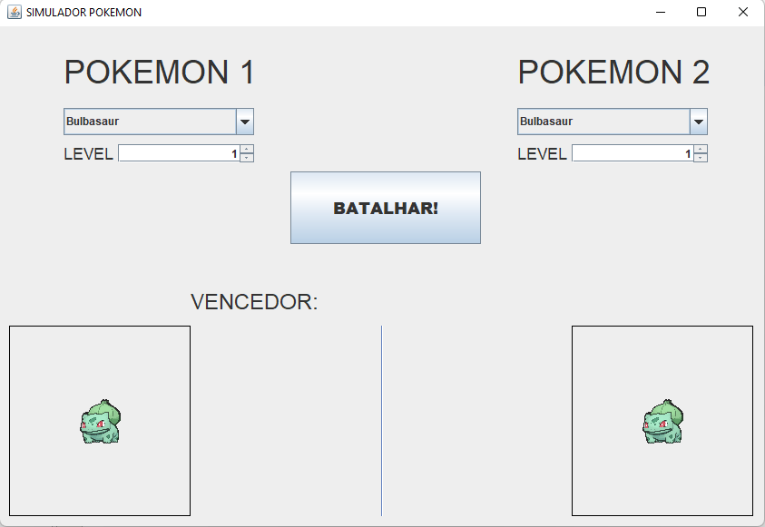
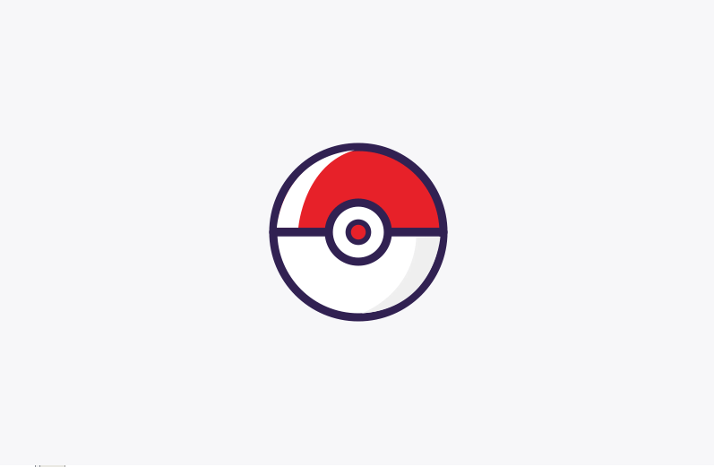

# Simulador Batalha Pokemon

> Este projeto foi feito para uma avaliação do curso de Linguagens de Programação, o intuito do projeto é simular uma batalha pokemon, cada pokemon foi extraido de um arquivo csv e os gifs foram baixados de um repositório aberto.

## Tela de Loading

> Tela de loading ao abrir o aplicativo.

## Feito com:

> 

[⬆ Voltar ao topo](#simulador-batalha-pokemon) 
